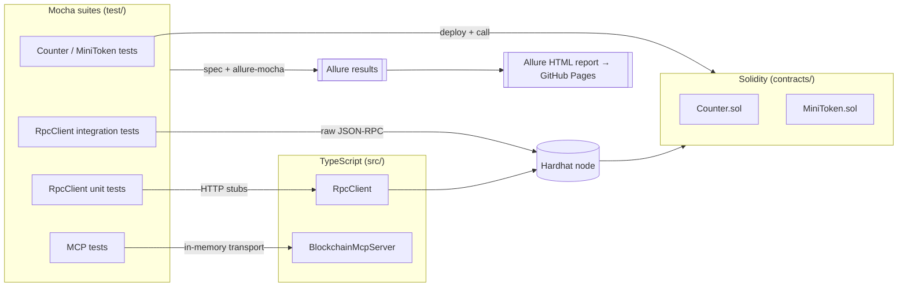

# Blockchain Testing Framework

[](https://github.com/VitarLaeda/blockchain-testing-framework/actions/workflows/ci.yml)
[](https://VitarLaeda.github.io/blockchain-testing-framework/)
[](./LICENSE)
[](https://nodejs.org/)
[](https://www.typescriptlang.org/)
[](#quality-gates)

A **Hardhat 3** and **TypeScript** test-automation showcase demonstrating three automated-test modules: local Solidity contract tests, JSON-RPC integration tests, and blockchain MCP server tests. The test run uses two reporters through `mocha-multi-reporters`: `spec` prints the complete test tree, steps, and summary in the terminal, while `allure-mocha` stores results for the HTML report. Each test is divided into `step(...)` calls with parameters such as addresses, amounts, RPC methods, and results; they are visible in both the terminal and the report.

> The latest Allure report is published automatically to **[GitHub Pages](https://VitarLaeda.github.io/blockchain-testing-framework/)** by CI on every push to `main`. One-time setup: in the repository settings, set **Pages → Build and deployment → Source** to **GitHub Actions**.

Two Solidity contracts are under test. **`Counter`** is a focused counter: anyone may `increment()`, only the owner may `reset()`. **`MiniToken`** is a compact ERC-20-style token with owner-restricted `mint`, standard `transfer(to, amount)`, and allowance-based `approve` / `transferFrom`. The JSON-RPC module drives both contracts directly through `eth_sendTransaction` and `eth_call`.

## Architecture



## Skills demonstrated

- **Test automation** across three layers: Solidity unit tests, JSON-RPC integration tests, and MCP protocol tests, all in one Mocha/TypeScript harness.
- **Robust client design** — a hand-written `RpcClient` with URL validation, typed errors, and timeout handling covering both the request and the response body, backed by **100% line/branch coverage** (see [Quality gates](#quality-gates)).
- **Deterministic integration testing** — a lifecycle runner that boots a Hardhat node on a loopback-only endpoint, waits for readiness, injects a canonical `RPC_URL`, and tears everything down.
- **Reporting & observability** — parameterized `step(...)` instrumentation surfaced in both the terminal (`spec`) and a published Allure HTML report.
- **CI/CD & tooling** — GitHub Actions running lint, type-check, tests, and coverage, then publishing the report to GitHub Pages; oxlint, Prettier, solhint, and pre-commit hooks enforce quality locally.

## Requirements

- **Node.js** >= 22 (see `engines` in `package.json`)
- **npm** (included with Node.js)
- **Java** (JRE 8+) only to generate the Allure report (`npm run report`), not to run tests

## Installation

```bash
npm install
```

## Quick start

```bash
npm run compile
npm test
npm run report
```

The report is a multi-file HTML application; do **not** open `index.html` directly via `file://`, because the browser will block resource loading. To view it locally:

```bash
REPORT_OPEN=true npm run report
```

```powershell
$env:REPORT_OPEN="true"; npm run report
```

`allure open` starts a local HTTP server and **blocks** the terminal until it is stopped with Ctrl+C. In CI, upload `reports/allure-report/` as an artifact and open it through the pipeline HTTP viewer.

After `npm run report`, stdout includes `REPORT_INDEX=<absolute path>`. The `reports/` directory is in `.gitignore`, so its artifacts are not committed.

## Test modules

| Module      | Command                  | Coverage                                                                                                                                                                                                                                      |
| ----------- | ------------------------ | --------------------------------------------------------------------------------------------------------------------------------------------------------------------------------------------------------------------------------------------- |
| Contracts   | `npm run test:contracts` | 15 tests on a local Hardhat EDR network: `Counter` (increment/reset, fixtures) and `MiniToken` (mint, transfer, approve/transferFrom, custom errors `Unauthorized`, `InvalidAddress`, `InsufficientBalance`, `InsufficientAllowance`, events) |
| JSON-RPC    | `npm run test:rpc`       | Node-independent unit tests (URL validation, error envelopes, transport/timeout) plus integration tests: a lifecycle runner boots a Hardhat node and drives `Counter` and `MiniToken` via `eth_sendTransaction` and `eth_call`                |
| MCP         | `npm run test:mcp`       | Official MCP SDK with in-memory transport and the `get_chain_metadata` and `to_wei` tools                                                                                                                                                     |
| All modules | `npm test`               | Runs contracts → RPC → MCP in sequence                                                                                                                                                                                                        |

For details, see [docs/contract-tests.md](docs/contract-tests.md), [docs/rpc-tests.md](docs/rpc-tests.md), and [docs/mcp-tests.md](docs/mcp-tests.md).

## npm scripts

| Script           | Purpose                                                                 |
| ---------------- | ----------------------------------------------------------------------- |
| `compile`        | `hardhat compile` — compiles Solidity                                   |
| `typecheck`      | `tsc --noEmit` — type-checks the project                                |
| `lint`           | oxlint + solhint + Prettier check                                       |
| `lint:fix`       | Auto-fix lint issues with oxlint                                        |
| `format`         | Format the repo with Prettier                                           |
| `test:contracts` | Mocha: `Counter` and `MiniToken` contract tests                         |
| `test:rpc`       | RPC unit tests, then integration tests via `scripts/run-rpc-tests.mjs`  |
| `test:mcp`       | Mocha: `test/mcp/BlockchainMcpServer.test.ts`                           |
| `test`           | Runs all three modules                                                  |
| `coverage`       | Solidity contract-test coverage (`--coverage`)                          |
| `coverage:ts`    | c8 coverage for the TypeScript sources (enforced ≥ 90%, currently 100%) |
| `gas`            | Contract-test gas statistics → `reports/gas-stats.json`                 |
| `report`         | `node scripts/generate-report.mjs` — HTML from `reports/allure-results` |
| `clean`          | `hardhat clean`                                                         |

Reporting details: [docs/reporting.md](docs/reporting.md).

## Quality gates

The same checks run locally and in CI (`.github/workflows/ci.yml`):

```bash
npm run typecheck    # tsc --noEmit (strict)
npm run lint         # oxlint + solhint + prettier --check
npm test             # 50 tests across contracts, JSON-RPC, and MCP
npm run coverage:ts  # c8 — 100% lines/branches/functions on src/ (min 90%)
```

A Husky `pre-commit` hook runs `lint-staged` (oxlint + Prettier on staged files, solhint on `.sol`) and `tsc --noEmit`.

## Project structure

```
contracts/            # Solidity: Counter.sol, MiniToken.sol (with NatSpec)
src/
  rpc/                # RpcClient
  mcp/                # BlockchainMcpServer, McpTestClient
test/
  contracts/          # Counter.test.ts, MiniToken.test.ts
  rpc/                # RpcClient.unit.test.ts (no node), RpcClient.test.ts (integration)
  mcp/                # BlockchainMcpServer.test.ts
  support/            # reporting.ts — step(...) wrapper with parameters and terminal logging
scripts/
  run-rpc-tests.mjs   # RPC lifecycle runner
  generate-report.mjs # Allure HTML generation
  clean-allure-results.mjs
.github/workflows/    # ci.yml — lint, type-check, test, coverage, publish report
reports/              # allure-results, allure-report, gas-stats (gitignored)
coverage/             # c8 TypeScript coverage output (gitignored)
hardhat.config.ts     # spec + allure-mocha (mocha-multi-reporters) → reports/allure-results
```

Tooling configs: `.oxlintrc.json`, `.solhint.json`, `.prettierrc.json`, `.c8rc.json`, `.editorconfig`, `.nvmrc`.

## Environment variables

| Variable                 | Used by                          | Default                                                                                                                                                                                                                                                                                      |
| ------------------------ | -------------------------------- | -------------------------------------------------------------------------------------------------------------------------------------------------------------------------------------------------------------------------------------------------------------------------------------------- |
| `RPC_HOST`               | `test:rpc` runner                | `127.0.0.1` (loopback only)                                                                                                                                                                                                                                                                  |
| `RPC_PORT`               | `test:rpc` runner                | `8545`                                                                                                                                                                                                                                                                                       |
| `RPC_STARTUP_TIMEOUT_MS` | node startup timeout             | `30000`                                                                                                                                                                                                                                                                                      |
| `RPC_URL`                | Direct integration-test run only | **Required** only when running `test/rpc/RpcClient.test.ts` directly; `npm run test:rpc` sets a canonical value itself and ignores any inherited `RPC_URL`. Not used by the unit tests.                                                                                                      |
| `REPORT_OPEN`            | `npm run report`                 | Generate only by default; `true` after trim/lowercase, such as `TRUE` or `true`, runs `allure open` after generation and blocks until Ctrl+C. Any other value only generates the report. Set it in `.env` or the process environment; the caller's environment takes precedence over `.env`. |

The `.env` file is loaded by `dotenv` in `hardhat.config.ts` and `scripts/generate-report.mjs`. Do not commit secrets.

## Security

- The RPC runner accepts only loopback hosts: `127.0.0.1`, `localhost`, and `::1`.
- MCP tests use in-memory transport, without Cursor, wallets, private keys, or external RPC.
- Contract tests run on a simulated local Hardhat network.
- `reports/` and `.env` are listed in `.gitignore`.

## Documentation

- [Contract tests](docs/contract-tests.md)
- [JSON-RPC tests](docs/rpc-tests.md)
- [MCP tests](docs/mcp-tests.md)
- [Allure reporting](docs/reporting.md)

## Troubleshooting

### `npm run report` has no results

```
Allure results not found in: <path>/reports/allure-results
No *-result.json files present. Run the test suites first to collect results:
  npm test
```

First run `npm test` (or individual `test:*` commands), then run `npm run report`.

### Java / Allure

Generating the report requires Java on `PATH`:

```bash
java -version
```

If Allure CLI generation fails, the script prints diagnostics with Java installation examples for Windows (`winget`), macOS (`brew`), and Debian/Ubuntu (`apt`), then exits with a nonzero status. The commands are examples; a new terminal may be required after installation. Result-directory access errors produce separate filesystem diagnostics without Java instructions. A global Allure installation is not needed; `allure-commandline` from `node_modules` is used.

### RPC: port is busy

The runner listens on `127.0.0.1:8545` by default. If the port is busy:

```bash
$env:RPC_PORT="8546"; npm run test:rpc
```

`RPC_HOST` must remain a loopback address.

### Node.js < 22

```bash
node -v
```

The project requires Node >= 22. Upgrade Node or use nvm/fnm.

### TypeScript

```bash
npm run typecheck
```

This runs `tsc --noEmit` to type-check the project without emitting JavaScript.
